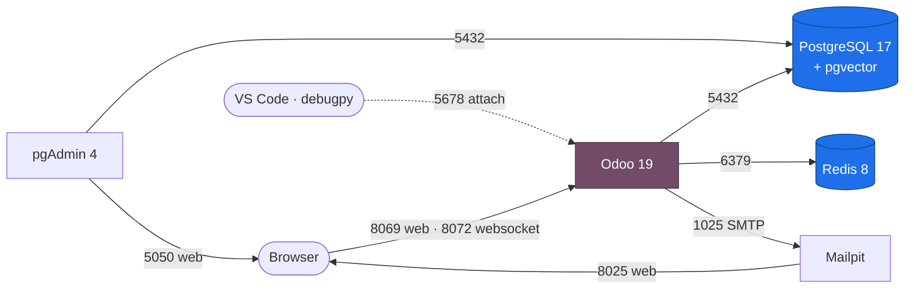

<div align="center">

# Odoo Self-Hosted

### A complete, containerized Odoo 19 environment for learning, exploring, and building.

<p>
  
  
  
  
  
</p>

<sub>PostgreSQL ships with <code>pgvector</code> for Odoo 19 AI features. pgAdmin and Mailpit are bundled for database and email exploration.</sub>

</div>

---

This repository is a self-contained Odoo stack built with Docker Compose. It is designed as a learning workbench: every service is pinned, every credential lives in one place, and the harder topics (module development, remote debugging, database internals, and email flows) are wired up and ready to explore.

## Architecture



## Table of Contents

- [Features](#features)
- [Tech Stack](#tech-stack)
- [Prerequisites](#prerequisites)
- [Quick Start](#quick-start)
- [Services and Access](#services-and-access)
- [Configuration](#configuration)
- [Everyday Commands](#everyday-commands)
- [Building a Custom Module](#building-a-custom-module)
- [Debugging with VS Code](#debugging-with-vs-code)
- [Database with pgAdmin](#database-with-pgadmin)
- [Backup and Restore](#backup-and-restore)
- [Email Testing with Mailpit](#email-testing-with-mailpit)
- [Project Structure](#project-structure)
- [Troubleshooting](#troubleshooting)
- [Learning Resources](#learning-resources)
- [License](#license)

## Features

- **Latest stable versions**, pinned for reproducibility: Odoo 19, PostgreSQL 17, Redis 8.
- **pgvector built in** so Odoo 19 AI and similarity-search features work out of the box.
- **One secrets file.** All passwords live in `.env` (git-ignored). Nothing sensitive is committed.
- **Hot reload** for addon code via Odoo dev mode and `watchdog`.
- **Remote debugging** with `debugpy` and a ready-to-use VS Code attach configuration.
- **pgAdmin** pre-registered against the database for visual exploration of Odoo's schema.
- **Mailpit** captures every outgoing email so nothing leaks while you test.
- **Tuned VS Code workspace** with Python, XML, YAML, and Docker support, and noisy extensions disabled.
- **Persistent named volumes** for the database, filestore, Redis, and pgAdmin.

## Tech Stack

| Component | Image | Version | Role |
| :-- | :-- | :-- | :-- |
| Odoo | `odoo:19.0` (extended) | 19.0 | Application server |
| PostgreSQL | `pgvector/pgvector:pg17` | 17 + pgvector | Primary database |
| Redis | `redis:8-alpine` | 8 | Cache and session store |
| pgAdmin | `dpage/pgadmin4` | latest | Database administration UI |
| Mailpit | `axllent/mailpit` | latest | Outgoing mail catcher |

> [!NOTE]
> Odoo 19 supports PostgreSQL up to version 17, which is why 17 is the pinned choice rather than a newer line. The base Odoo image is extended (see [`docker/Dockerfile`](docker/Dockerfile)) only to add `debugpy`, `ipython`, and `watchdog`.

## Prerequisites

- [Docker Engine](https://docs.docker.com/engine/install/) 24 or newer
- [Docker Compose](https://docs.docker.com/compose/install/) v2 (bundled with modern Docker Desktop)
- About 4 GB of free RAM and 5 GB of disk for images and volumes

Verify your setup:

```bash
docker --version
docker compose version
```

## Quick Start

```bash
# 1. Clone and enter the project
git clone https://github.com/isyll/odoo-self-hosted.git
cd odoo-self-hosted

# 2. Create your local secrets file from the template
cp .env.example .env

# 3. Build the Odoo image and start the full stack
docker compose up -d --build

# 4. Follow the Odoo logs until it reports it is listening
docker compose logs -f odoo
```

Open <http://localhost:8069>. On first launch, Odoo shows its database manager.

> [!IMPORTANT]
> The database master password is the `admin_passwd` value in [`config/odoo.conf`](config/odoo.conf) (default `admin`). Odoo only accepts this setting from its config file, never from the command line. You need it to create, duplicate, or drop databases from the manager screen.

Create a database, set an admin login and password, optionally load demo data, and you are in.

## Services and Access

| Service | URL | Host Port | Credentials |
| :-- | :-- | :-- | :-- |
| Odoo | <http://localhost:8069> | 8069, 8072 | Set when you create the database |
| pgAdmin | <http://localhost:5050> | 5050 | `PGADMIN_DEFAULT_EMAIL` / `PGADMIN_DEFAULT_PASSWORD` |
| Mailpit | <http://localhost:8025> | 8025, 1025 | None |
| PostgreSQL | `localhost:5432` | 5432 | `POSTGRES_USER` / `POSTGRES_PASSWORD` |
| Redis | `localhost:6379` | 6379 | `REDIS_PASSWORD` |
| debugpy | `localhost:5678` | 5678 | Used by the VS Code debugger |

> [!TIP]
> Every port except Odoo's web ports is bound to `127.0.0.1`, so the database, cache, mail, and debugger are reachable only from your machine.

## Configuration

All configurable values live in `.env`. The committed [`.env.example`](.env.example) is the template.

| Variable | Default | Purpose |
| :-- | :-- | :-- |
| `POSTGRES_USER` | `odoo` | Database role Odoo connects with |
| `POSTGRES_PASSWORD` | `odoo` | Password for that role |
| `POSTGRES_DB` | `postgres` | Maintenance database, not an Odoo database |
| `REDIS_PASSWORD` | `redis` | Redis authentication password |
| `PGADMIN_DEFAULT_EMAIL` | `admin@admin.com` | pgAdmin login (avoid reserved domains such as `.local`) |
| `PGADMIN_DEFAULT_PASSWORD` | `admin` | pgAdmin password |

> [!WARNING]
> The defaults are for local learning only. Change every password before exposing this stack to a network you do not fully control.

The host ports are configurable too. If a port is already taken on your machine (a local PostgreSQL on 5432 or Redis on 6379 is common), set the matching variable in `.env`: `ODOO_PORT`, `ODOO_LONGPOLLING_PORT`, `DB_PORT`, `REDIS_PORT`, `PGADMIN_PORT`, `MAILPIT_UI_PORT`, `MAILPIT_SMTP_PORT`, or `DEBUGPY_PORT`.

Odoo's runtime tuning lives in [`config/odoo.conf`](config/odoo.conf). Database credentials are kept out of that file and injected at runtime from `.env`, so no infrastructure secret is committed. The Odoo master password (`admin_passwd`) is the one exception: Odoo only reads it from the config file, so it lives there with a documented local default. Key options already set:

- `admin_passwd = admin` is the master password for the database manager. Change it before any real use.
- `workers = 0` runs Odoo threaded, the right mode for hot reload and debugging.
- `smtp_server = mailpit` routes outgoing mail to the Mailpit catcher by default.

Developer mode (`--dev=reload,qweb,werkzeug,xml`) is passed on the Odoo command in [`docker-compose.yml`](docker-compose.yml), which enables hot reload of addon code.

## Everyday Commands

<details>
<summary><b>Lifecycle</b></summary>

```bash
docker compose up -d            # start in the background
docker compose up -d --build    # rebuild the Odoo image, then start
docker compose stop             # stop containers, keep data
docker compose down             # remove containers, keep volumes
docker compose down -v          # remove containers and all data volumes
docker compose ps               # list service status
docker compose restart odoo     # restart only Odoo
```

</details>

<details>
<summary><b>Logs and shells</b></summary>

```bash
docker compose logs -f odoo                 # tail Odoo logs
docker compose logs -f db                   # tail PostgreSQL logs
docker compose exec odoo bash               # shell inside the Odoo container
docker compose exec db psql -U odoo postgres   # open psql
docker compose exec redis redis-cli -a "$REDIS_PASSWORD" ping
```

</details>

<details>
<summary><b>Odoo CLI</b></summary>

```bash
# Interactive Odoo shell against a database (great for exploring the ORM)
docker compose exec odoo odoo shell -d mydb

# Update a module after changing its code
docker compose exec odoo odoo -d mydb -u my_module --stop-after-init

# Install a module from the command line
docker compose exec odoo odoo -d mydb -i my_module --stop-after-init

# Run a module's tests
docker compose exec odoo odoo -d mydb -i my_module --test-enable --stop-after-init
```

</details>

## Building a Custom Module

Your `addons/` directory is mounted into the container at `/mnt/extra-addons`, which is on Odoo's `addons_path`. A working example module named `library` is already included, so the path is active out of the box. In Odoo, open **Apps**, remove the default **Apps** filter, search for "Library", and install it to see a model, list and form views, a menu, and access rules in action.

> [!NOTE]
> Odoo only treats a folder as an addons path once it contains at least one module (a subfolder with both `__init__.py` and `__manifest__.py`). The bundled `library` module keeps `addons/` valid. If you remove it and leave the folder empty, Odoo will skip the path until you add a module.

```bash
# Scaffold a new module skeleton into your addons directory
docker compose exec odoo odoo scaffold my_module /mnt/extra-addons
```

Then, in Odoo, enable developer mode, open **Apps**, click **Update Apps List**, and install your module. With dev mode reload active, Python and view changes are picked up without a manual restart. For structural changes (new fields, new models) run an update:

```bash
docker compose exec odoo odoo -d mydb -u my_module --stop-after-init
docker compose restart odoo
```

## Debugging with VS Code

The Odoo image includes `debugpy`, and a launch configuration is provided in [`.vscode/launch.json`](.vscode/launch.json).

1. Start the stack in debug mode. The override starts Odoo under `debugpy` and waits for the debugger to attach before booting:

   ```bash
   docker compose -f docker-compose.yml -f docker-compose.debug.yml up
   ```

2. In VS Code, open the **Run and Debug** panel, select **Attach to Odoo (Docker)**, and press <kbd>F5</kbd>.
3. Set breakpoints in any file under `addons/`. The path mapping links your local files to `/mnt/extra-addons` in the container.

> [!TIP]
> To run normally again (no waiting, hot reload on), just use `docker compose up -d` without the debug override file.

## Database with pgAdmin

Open <http://localhost:5050> and log in with your `PGADMIN_DEFAULT_EMAIL` and `PGADMIN_DEFAULT_PASSWORD`. The Odoo PostgreSQL server is pre-registered, so expand **Servers**, enter the `POSTGRES_PASSWORD` when prompted, and browse the live Odoo schema, tables, and queries.

## Backup and Restore

```bash
# Back up a database to a compressed file in ./backups
mkdir -p backups
docker compose exec -T db pg_dump -U odoo -Fc mydb > backups/mydb.dump

# Restore into a fresh database
docker compose exec -T db createdb -U odoo mydb_restored
docker compose exec -T db pg_restore -U odoo -d mydb_restored < backups/mydb.dump
```

> [!NOTE]
> Odoo also stores attachments in a filestore inside the `odoo-data` volume. The built-in **Backup** option in the database manager captures both the database and the filestore in a single zip, which is the simplest path for a full backup.

## Email Testing with Mailpit

Odoo is configured to send all outgoing mail to Mailpit instead of the real internet. Trigger any email in Odoo (invite a user, send a quotation, reset a password) and watch it arrive at <http://localhost:8025>. Nothing ever leaves your machine.

## Project Structure

```text
odoo-self-hosted/
├── .vscode/
│   ├── extensions.json        Recommended and disabled extensions
│   ├── launch.json            debugpy attach configuration
│   └── settings.json          Workspace editor and linter settings
├── addons/
│   └── library/               Example module (model, views, menu, security)
├── config/
│   └── odoo.conf              Odoo runtime configuration
├── docker/
│   └── Dockerfile             Odoo image extended with dev tooling
├── pgadmin/
│   └── servers.json           Pre-registered database connection
├── .dockerignore
├── .editorconfig
├── .env.example               Template for your local .env
├── .gitignore
├── docker-compose.yml         The full stack
├── docker-compose.debug.yml   Debug override for debugpy
├── LICENSE
└── README.md
```

## Troubleshooting

<details>
<summary><b>Odoo cannot connect to the database</b></summary>

Compose waits for the database health check before starting Odoo, but if you see connection errors, confirm the database is healthy:

```bash
docker compose ps
docker compose logs db
```

Make sure `POSTGRES_USER` and `POSTGRES_PASSWORD` in `.env` match what Odoo uses. If you changed them after the first run, the existing volume still holds the old credentials. Reset with `docker compose down -v` (this deletes all data).

</details>

<details>
<summary><b>Port already in use</b></summary>

Another process is using 8069, 5432, 5050, or another mapped port. Either stop that process, or change the host side of the mapping in `docker-compose.yml`, for example `"8070:8069"`.

</details>

<details>
<summary><b>My code changes are not showing up</b></summary>

Python model and view changes load via dev reload, but adding fields, models, or security rules requires a module update:

```bash
docker compose exec odoo odoo -d mydb -u my_module --stop-after-init
docker compose restart odoo
```

</details>

<details>
<summary><b>Reset everything</b></summary>

```bash
docker compose down -v        # remove containers and all volumes
docker compose up -d --build  # rebuild and start fresh
```

</details>

## Learning Resources

- [Odoo 19 Documentation](https://www.odoo.com/documentation/19.0/)
- [Odoo Developer Tutorials](https://www.odoo.com/documentation/19.0/developer/tutorials.html)
- [Odoo ORM Reference](https://www.odoo.com/documentation/19.0/developer/reference/backend/orm.html)
- [PostgreSQL 17 Documentation](https://www.postgresql.org/docs/17/)
- [Docker Compose Reference](https://docs.docker.com/compose/)

## License

Released under the [MIT License](LICENSE).

<div align="center">
<sub>Built for learning. Pin your versions, read the logs, and break things safely.</sub>
</div>
